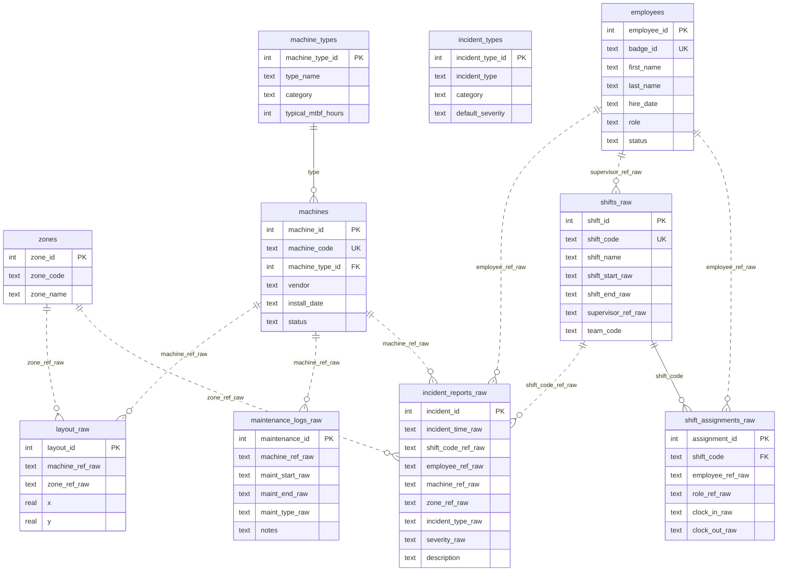

# Database Schema Reference

This document describes the factory incident database schema and relationships.

---

## ER Diagram (Mermaid)



---

## ER Diagram (ASCII)

```
┌─────────────────────────────────────────────────────────────────────────────────┐
│                              REFERENCE TABLES (Clean)                           │
├─────────────────────────────────────────────────────────────────────────────────┤
│                                                                                 │
│  ┌──────────────────┐   ┌──────────────────┐   ┌──────────────────┐            │
│  │  machine_types   │   │  incident_types  │   │      zones       │            │
│  ├──────────────────┤   ├──────────────────┤   ├──────────────────┤            │
│  │ machine_type_id  │   │ incident_type_id │   │ zone_id          │            │
│  │ type_name        │   │ incident_type    │   │ zone_code        │            │
│  │ category         │   │ category         │   │ zone_name        │            │
│  │ typical_mtbf_hrs │   │ default_severity │   └──────────────────┘            │
│  └────────┬─────────┘   └──────────────────┘                                   │
│           │                                                                     │
└───────────┼─────────────────────────────────────────────────────────────────────┘
            │
            │ FK
            ▼
┌─────────────────────────────────────────────────────────────────────────────────┐
│                              DIMENSION TABLES (Clean)                           │
├─────────────────────────────────────────────────────────────────────────────────┤
│                                                                                 │
│  ┌──────────────────┐                        ┌──────────────────┐              │
│  │     machines     │                        │    employees     │              │
│  ├──────────────────┤                        ├──────────────────┤              │
│  │ machine_id    PK │                        │ employee_id   PK │              │
│  │ machine_code     │ ◄─── M-001 format      │ badge_id         │ ◄─── B0001  │
│  │ machine_type_id  │                        │ first_name       │              │
│  │ vendor           │                        │ last_name        │              │
│  │ install_date     │                        │ hire_date        │              │
│  │ status           │                        │ role             │              │
│  └──────────────────┘                        │ status           │              │
│           ▲                                  └──────────────────┘              │
│           │                                           ▲                        │
│           │ (join via normalized machine_code)        │ (join via normalized   │
│           │                                           │  badge_id or name)     │
└───────────┼───────────────────────────────────────────┼────────────────────────┘
            │                                           │
            │ string refs (messy)                       │ string refs (messy)
            │                                           │
┌───────────┼───────────────────────────────────────────┼────────────────────────┐
│           │           RAW TABLES (Messy)              │                        │
├───────────┼───────────────────────────────────────────┼────────────────────────┤
│           │                                           │                        │
│  ┌────────┴─────────┐        ┌────────────────────────┴───┐                    │
│  │   layout_raw     │        │       shifts_raw           │                    │
│  ├──────────────────┤        ├────────────────────────────┤                    │
│  │ layout_id     PK │        │ shift_id                PK │                    │
│  │ machine_ref_raw  │        │ shift_code           (key) │◄──────────┐        │
│  │ zone_ref_raw     │        │ shift_name  (Day/Swing/Ngt)│           │        │
│  │ x, y             │        │ shift_start_raw            │           │        │
│  │ row_num, col_num │        │ shift_end_raw              │           │        │
│  │ effective_from   │        │ supervisor_ref_raw ────────┼───► employee       │
│  └──────────────────┘        │ team_code                  │           │        │
│                              │ created_at_iso             │           │        │
│                              └─────────────┬──────────────┘           │        │
│                                            │                          │        │
│                                            │ shift_code               │        │
│                                            ▼                          │        │
│                              ┌────────────────────────────┐           │        │
│                              │  shift_assignments_raw     │           │        │
│                              ├────────────────────────────┤           │        │
│                              │ assignment_id           PK │           │        │
│                              │ shift_code                 │───────────┘        │
│                              │ employee_ref_raw ──────────┼───► employee       │
│                              │ role_ref_raw               │                    │
│                              │ clock_in_raw               │                    │
│                              │ clock_out_raw              │                    │
│                              │ created_at_iso             │                    │
│                              └────────────────────────────┘                    │
│                                                                                │
│  ┌────────────────────────────────────────┐   ┌──────────────────────────┐     │
│  │       incident_reports_raw             │   │  maintenance_logs_raw    │     │
│  ├────────────────────────────────────────┤   ├──────────────────────────┤     │
│  │ incident_id                         PK │   │ maintenance_id        PK │     │
│  │ incident_time_raw                      │   │ machine_ref_raw ─────────┼──►  │
│  │ reported_time_raw                      │   │ maint_start_raw          │  m  │
│  │ shift_code_ref_raw ───► shifts_raw     │   │ maint_end_raw            │  a  │
│  │ employee_ref_raw ─────► employees      │   │ maint_type_raw           │  c  │
│  │ machine_ref_raw ──────► machines       │   │ notes                    │  h  │
│  │ zone_ref_raw ─────────► zones          │   │ created_at_iso           │  i  │
│  │ incident_type_raw                      │   └──────────────────────────┘  n  │
│  │ severity_raw                           │                                 e  │
│  │ description                            │                                 s  │
│  │ created_at_iso                         │                                    │
│  └────────────────────────────────────────┘                                    │
│                                                                                │
└────────────────────────────────────────────────────────────────────────────────┘
```

---

## Table Descriptions

### Reference Tables (Clean, Static)

| Table | Purpose | Rows |
|-------|---------|------|
| `machine_types` | Categories of machines (Press, CNC, etc.) | 6 |
| `incident_types` | Categories of incidents (machine_failure, etc.) | 8 |
| `zones` | Factory areas (Z-01 through Z-06) | 6 |

### Dimension Tables (Clean, Slowly Changing)

| Table | Purpose | Rows |
|-------|---------|------|
| `employees` | Staff records with badge_id, name, role | ~60 |
| `machines` | Equipment inventory with machine_code | ~40 |

### Raw Tables (Messy, Transactional)

| Table | Purpose | Rows |
|-------|---------|------|
| `shifts_raw` | Shift schedule (3 per day) | ~2,200 |
| `shift_assignments_raw` | Who worked each shift | ~40,000 |
| `incident_reports_raw` | Incident records | ~450 |
| `maintenance_logs_raw` | Repair/maintenance records | ~250 |
| `layout_raw` | Machine locations in factory | ~43 |

---

## Key Relationships

### Direct Foreign Keys (Clean Tables)

```
machines.machine_type_id → machine_types.machine_type_id
```

### String-Based References (Raw → Clean)

These require normalization before joining:

| Raw Table | Raw Field | Target Table | Target Field |
|-----------|-----------|--------------|--------------|
| `incident_reports_raw` | `machine_ref_raw` | `machines` | `machine_code` |
| `incident_reports_raw` | `employee_ref_raw` | `employees` | `badge_id` or name |
| `incident_reports_raw` | `zone_ref_raw` | `zones` | `zone_code` |
| `incident_reports_raw` | `shift_code_ref_raw` | `shifts_raw` | `shift_code` |
| `shift_assignments_raw` | `employee_ref_raw` | `employees` | `badge_id` or name |
| `shifts_raw` | `supervisor_ref_raw` | `employees` | `badge_id` or name |
| `maintenance_logs_raw` | `machine_ref_raw` | `machines` | `machine_code` |
| `layout_raw` | `machine_ref_raw` | `machines` | `machine_code` |
| `layout_raw` | `zone_ref_raw` | `zones` | `zone_code` |

---

## Data Flow

```
                    Schedule                        Operations
                    ────────                        ──────────
                    
shifts_raw ◄───────────────────────────────────── shift_assignments_raw
    │                                                     │
    │ (shift defines time window)                         │ (who was working)
    │                                                     │
    └──────────────────────┬──────────────────────────────┘
                           │
                           ▼
                  incident_reports_raw ──────────► maintenance_logs_raw
                           │                              │
                           │                              │
                           ▼                              ▼
                      (what happened)              (how it was fixed)
```

---

## What You CAN Query

| Question | Tables Needed |
|----------|---------------|
| Which machines have the most incidents? | `incident_reports_raw` → `machines` |
| Which employees are in the most incidents? | `incident_reports_raw` → `employees` |
| What's the incident rate per shift type? | `incident_reports_raw` → `shifts_raw` |
| Which machine types fail most? | `incident_reports_raw` → `machines` → `machine_types` |
| Who supervised a given shift? | `shifts_raw` → `employees` |
| Who worked a given shift? | `shift_assignments_raw` → `employees` |
| Where is a machine located? | `layout_raw` → `machines`, `zones` |

---

## What You CANNOT Query (Data Gaps)

| Question | Why Not |
|----------|---------|
| Who operated which machine during a shift? | No machine assignment table |
| Which employee fixed a machine? | `maintenance_logs_raw` has no employee field |
| What was the root cause of an incident? | Only free-text `description` field |
| Machine utilization/uptime | No production or runtime logs |

---

## Canonical Formats

When normalizing raw fields, target these formats:

| Entity | Canonical Format | Example |
|--------|------------------|---------|
| Machine | `M-XXX` | `M-017` |
| Employee Badge | `BXXXX` | `B0042` |
| Zone | `Z-XX` | `Z-02` |
| Shift Code | `S-YYYYMMDD-{D\|S\|N}` | `S-20240115-D` |
| Date/Time | ISO 8601 | `2024-01-15T14:30:00` |
